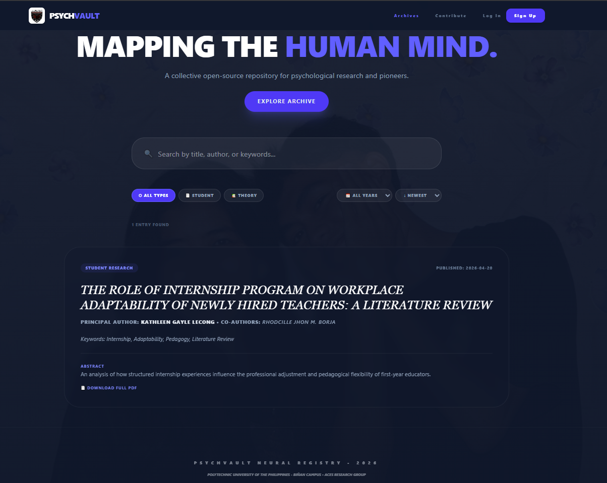
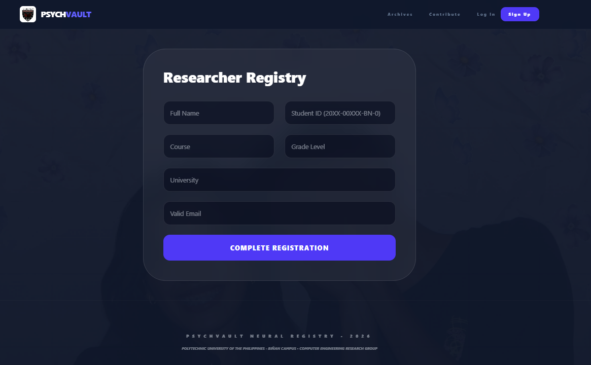
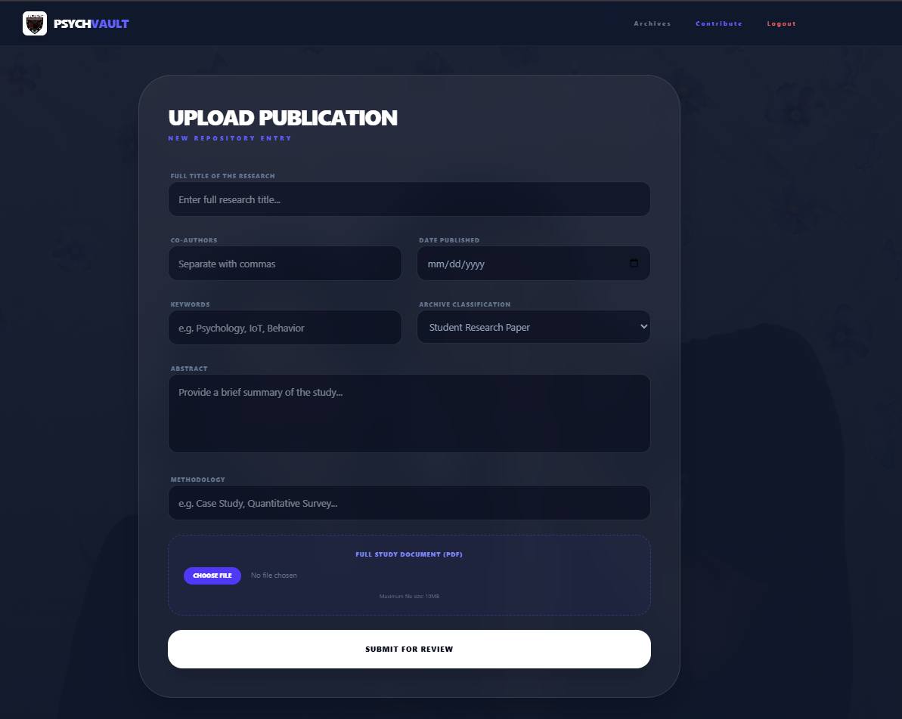

# 🧠 PsychVault - Neural Research Registry

**PsychVault** is a high-performance, full-stack research repository engineered for the **PUP Biñan Campus** academic community. It serves as a centralized "Neural Vault" for archiving psychological theories and student-led studies, effectively bridging the gap between student contributors and scholarly resources.

---

## 📸 Website Preview
 

---

## ✨ Core Features

* **Full-Stack Integration:** Robust real-time data persistence powered by **Supabase (PostgreSQL)**.
* **Intelligent Search & Filter:** Dynamic discovery engine allowing users to filter by research type (Student Research vs. Classical Theory), publication year, and multi-keyword matching.
* **Researcher Dashboard:** Personalized profile management featuring academic credentials, publication history, and **customizable profile pictures**.
* **Cloud Document Management:** Secure PDF hosting via **Supabase Storage**, offering users the flexibility to view manuscripts via an online reader or download them for offline review.
* **Granular Security:** Implementation of **Row Level Security (RLS)** policies to ensure only verified student researchers can manage and catalog entries.
* **High-Fidelity UI:** A modern **Glassmorphism** interface built with smooth tab-navigation and neural-inspired animations.

---

## 🛠️ Tech Stack

* **Frontend:** React 18, TypeScript, Vite
* **Backend-as-a-Service:** Supabase (Database, Auth, and Storage)
* **Styling:** Tailwind CSS (Custom Dark Mode & Neural UI components)
* **Security:** PostgreSQL RLS & Environment Variable Masking for production safety.

---

## 📂 Project Structure

* **/FullStack:** The core React application, components, and asset library.
* **.env:** (Ignored) Secure repository for Supabase API credentials.
* **supabaseClient.ts:** The dedicated communication bridge between the UI and the database.

---
*Developed by **Rhodcille Jhon M. Borja** | Association of Computer Engineering Students (ACES) - 2026*